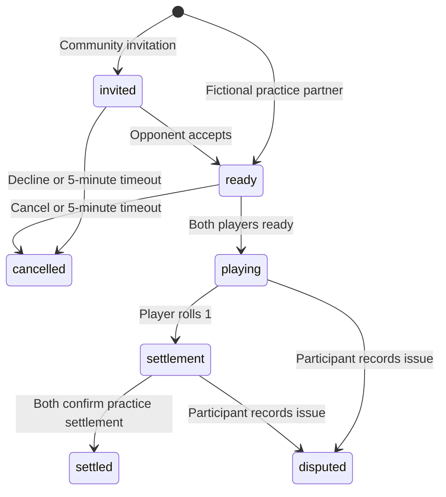

# Architecture and trust model

## Runtime

React + Vite renders a same-origin Express API. The dev server proxies `/api` to port 3001. The production process serves the built frontend and API together. SQLite stores JSON snapshots of profiles and matches plus sessions and the queue. No browser local storage contains session credentials. Only a SHA-256 hash of the random 256-bit cookie token is stored on disk.

Guest identities are self-reported and last seven days. They are suitable for practice, not creditworthiness or verified ownership. Match details are available only to the two participant sessions. Queue entries expose the self-reported character, meeting preference, stake settings, and practice history to compatible visitors; only opted-in entries are listed. Queue entries expire after 15 minutes and profile changes remove them.

## Match lifecycle

Creation checks compatibility and reserves both real participants synchronously. Only one active match is allowed per participant. Sample partners can be used independently by multiple visitors. Concurrent requests in this single-process design cannot create two matches for the same user. A multi-process deployment would need explicit database transaction/locking changes.

Match terms are snapshots. Editing a profile is blocked during active matches. First player and rolls use Node's cryptographic `randomInt`; the website does not claim to use Blizzard's RNG. Only the expected participant can request the next roll. When a fictional partner is next, the server immediately generates its response. Players may inspect the complete sequence.

The initial range is 1–1000. Each subsequent range is 1–the previous result. One ends the match. There is no payout service, transferable currency balance, monetary prize, deposit, or escrow. Both participants explicitly acknowledge practice settlement. A fictional partner's acknowledgement is automatic and labeled simulated.

## Limits and reputation

Stake ranges and preferred values are validated on the server. The suggested stake is the rounded average of the preferred values, clamped to the overlap of both ranges. Region, ruleset, and faction must match. Ranking prioritizes the same meeting place, closeness to preferred stake, and queue wait time. No hidden stake increases are permitted.

The limit is a daily practice loss limit per guest profile, resetting at midnight UTC. Completed losses count even when disputed or unconfirmed. A match's entire stake must fit inside each person's remaining limit before creation. It is not a cross-account or cross-game financial control; users may explicitly change the limit when no match is active.

Community establishment currently means at least five settled, non-sample practice matches. This is a prototype heuristic, not anti-fraud scoring. Distinct opponents are shown, but collusion detection, stake-band weighting, account linkage, appeal adjudication, and moderation queues are future work. Disputes stay private and do not automatically mark someone as a scammer.

## Website–addon boundary

The only bridge is manual copy/paste. Tickets carry complete practice terms. Addon receipts are optional, client-supplied attachments. The browser and in-game rolls are different practice runs; a receipt cannot alter server rolls, decide a winner, settle a match, or change reputation. Hashing an untrusted receipt would not establish that the underlying trade happened.

No live transport, screen scraping, memory access, layer fingerprinting, trade verification, automated input, or hidden addon channel advertising is present. The addon uses `CHAT_MSG_SYSTEM` and the client's localized `RANDOM_ROLL_RESULT` template; unknown formats and invalid participants/ranges are rejected. There is no promise that those APIs work unchanged in Forever.

## Production work still needed

- Verify actual client APIs and interface version, then test with two real characters and multiple client locales.
- Obtain specific Blizzard policy clarification before public gold matchmaking.
- Add supported identity verification, account recovery, deletion/retention, moderation, and operational monitoring.
- Replace guest-session establishment with defensible evidence levels and anti-collusion controls.
- Configure trusted proxies precisely if deployed; do not blindly trust forwarded headers.
- Maintain SQLite backups or migrate to a transactional shared database before multi-instance hosting.
